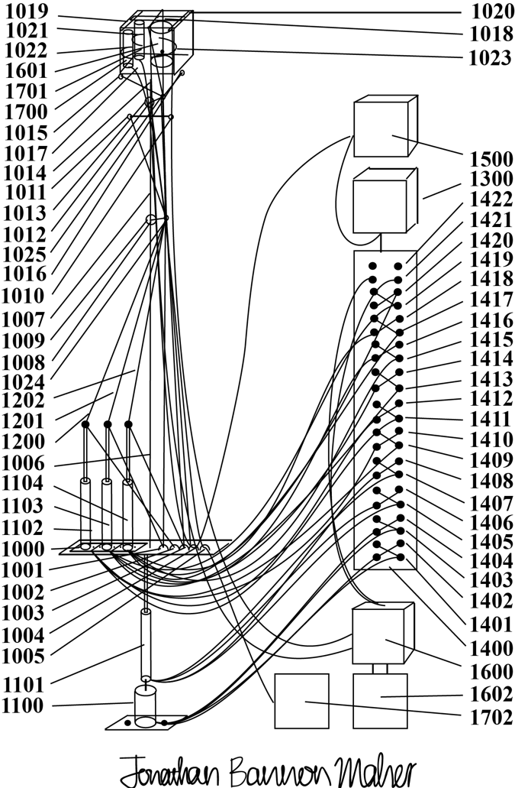

# Autonomous Cancer Removal System

Artificial intelligence operated surgery system utilizing small flexible mechanical arm for minimally invasive precision suction cutting and extraction of tissue including cancer.

